# Universidad Tecnológica de Panamá

## Facultad de Ingeniería de Sistemas Computacionales

---

# Proyecto Semestral. Documento Final

# Sistema de Diligencia Debida Reforzada (EDD)

### Aplicación de Cumplimiento AML/CFT para Panamá

---

| | |
|---|---|
| **Materia** | Ingeniería de Software IV |
| **Profesora** | María Mosquera |
| **Salón** | 1GS242 |
| **Integrantes** | César Santiago, Jean Suárez, Roberto López |
| **Repositorio** | https://github.com/aaacmsg/debida-diligencia-reforzada |
| **Tablero** | https://github.com/users/aaacmsg/projects/2 |
| **Fecha de entrega** | Julio de 2026 |

---

## Índice

1. Introducción y descripción del proyecto
2. Retrospectiva del equipo
   - 2.1 Problemas enfrentados
   - 2.2 Lecciones aprendidas
   - 2.3 Ajustes aplicados al proceso
   - 2.4 Responsabilidades individuales y colectivas
3. Adecuaciones del Parcial 2
   - 3.1 Funcionalidades ajustadas y nuevas
   - 3.2 Mejoras implementadas
   - 3.3 Métricas aplicadas (ISTQB, TMMi, TQM)
   - 3.4 Defectos corregidos
   - 3.5 Decisiones técnicas y su justificación
4. Versionamiento
   - 4.1 Historial de versiones del documento
   - 4.2 Control de versiones del software (Git)
   - 4.3 Flujo de trabajo con Pull Requests
5. Conclusiones
   - 5.1 Conclusiones y reflexiones individuales
   - 5.2 Conclusión grupal sobre la calidad del producto
   - 5.3 Evaluación del proceso colaborativo
   - 5.4 Recomendaciones para futuras iteraciones
6. Referencias
7. Anexos
   - Anexo A: capturas del sistema
   - Anexo B: reportes de pruebas ejecutadas y resultados
   - Anexo C: métricas aplicadas con valores reales e interpretación
   - Anexo D: evidencias de gestión y versionamiento
   - Anexo E: código relevante

---

## 1. Introducción y descripción del proyecto

El presente documento constituye la entrega final del Proyecto Semestral de la materia Ingeniería de Software IV. En él se recoge la retrospectiva del equipo, las adecuaciones realizadas después del Parcial 2, las métricas de calidad aplicadas durante el semestre, el versionamiento del proyecto y las conclusiones individuales y grupales, siguiendo las indicaciones entregadas por la profesora para el cierre del curso.

El producto desarrollado es el Sistema de Diligencia Debida Reforzada (EDD), una aplicación web pensada para que un sujeto obligado en Panamá (por ejemplo, una entidad financiera) pueda cumplir con sus obligaciones de prevención de blanqueo de capitales y financiamiento del terrorismo. En la práctica, esto significa que antes de aceptar a un cliente la institución debe identificarlo, conocer de dónde provienen sus fondos, determinar quiénes son sus beneficiarios finales y evaluar qué tan riesgoso resulta como cliente. Cuando ese riesgo es alto, la ley exige aplicar una diligencia reforzada, que incluye la aprobación expresa de la alta gerencia. El sistema automatiza este proceso completo.

El marco normativo que guio el diseño fue la Ley 23 de 2015, la Ley 254 de 2021 y la Resolución SBP-RG-PSO-R-2025-00671 de la Superintendencia de Bancos, tomando como referencia además las Recomendaciones 10, 12, 19 y 24 del GAFI. Estas normas no se citaron como un requisito formal: cada control del sistema (la fórmula de riesgo, el tratamiento especial de las Personas Expuestas Políticamente, la inmutabilidad de la auditoría, la conservación de registros) responde a un artículo o recomendación concreta, y esa correspondencia se indica a lo largo del documento.

El sistema maneja tres roles de usuario con permisos distintos: el Oficial de Cumplimiento, que registra clientes y revisa expedientes; la Alta Gerencia, que es la única autorizada para aprobar o rechazar los expedientes de alto riesgo; y el Administrador, que configura el sistema y gestiona los usuarios. Las funcionalidades principales son las siguientes:

- Formulario EDD de 7 módulos (identificación, información financiera, beneficiario final, perfil de riesgo, documentación, aprobación y auditoría) con validación en tiempo real.
- Cálculo automático del nivel de riesgo con una fórmula ponderada de 5 variables: País (25%), Cargo PEP (30%), Sector económico (15%), Vínculos (20%) y Origen de fondos (10%). La clasificación es: bajo (0 a 35), medio (36 a 65) y alto (66 a 100).
- Detección de Personas Expuestas Políticamente (PEP) mediante búsqueda difusa (RapidFuzz, umbral 85%) contra datos oficiales descargados de datosabiertos.gob.pa vía API CKAN. Todo cliente PEP queda en riesgo alto y requiere aprobación de Alta Gerencia, sin importar el score calculado.
- Gestión de expedientes con flujo de estados (borrador, pendiente de revisión, pendiente de gerencia, aprobado, rechazado), comentario de justificación obligatorio para aprobar o rechazar, y exportación del expediente a PDF.
- Grafo interactivo que muestra los vínculos entre clientes, beneficiarios finales y documentos.
- Trazabilidad inmutable (WORM): cada evento queda registrado con usuario, fecha UTC y dirección IP, y no puede modificarse ni eliminarse (Ley 23, Art. 21).
- Seguridad: autenticación JWT con refresh de tokens, control de acceso por roles (RBAC), límite de intentos de login por IP y documentos con hash SHA-256.

En cuanto a la tecnología, el equipo eligió FastAPI (Python 3.11) con SQLAlchemy 2.0 y PostgreSQL 15 para el backend, y React 18 con TypeScript, Vite y TailwindCSS para el frontend, apoyados en Redis 7 para tareas de fondo. Todo el sistema se ejecuta con Docker Compose, de manera que cualquier persona pueda levantarlo con un solo comando sin instalar dependencias a mano. La verificación se automatizó con pytest para el backend y Playwright para las pruebas de extremo a extremo, ambas integradas a GitHub Actions para que corran en cada cambio.

Es importante dejar constancia de las exclusiones del alcance: la consulta a listas restrictivas internacionales (OFAC, ONU, Unión Europea) no se implementó porque no existen APIs públicas gratuitas para consumirlas, y la firma digital avanzada requiere contratar proveedores comerciales. En lugar de simular estas funcionalidades, el equipo decidió documentarlas como trabajo futuro en el PRD, lo que consideramos una decisión más honesta desde el punto de vista de la ingeniería.

---

## 2. Retrospectiva del equipo

La retrospectiva que se presenta a continuación no es una lista de excusas sino un ejercicio honesto de mirar hacia atrás: qué salió mal, qué aprendimos de ello y qué cambiamos en nuestra forma de trabajar como consecuencia. El equipo fue registrando estos puntos durante el semestre (primero en el Daily Scrum del Parcial 2 y luego en la bitácora del cierre), de modo que lo que sigue proviene de notas tomadas en el momento y no de la memoria.

### 2.1 Problemas enfrentados

Durante el semestre el equipo enfrentó problemas de tres tipos: incompatibilidades de entorno (versiones de Python, diferencias entre Windows y Linux, puertos ocupados), defectos propios del código que no habíamos detectado, y una situación externa que obligó a cambiar el formato de la entrega. La siguiente tabla resume los diez más relevantes, con el impacto que tuvieron sobre el avance y la forma en que se resolvieron. Los defectos de código se explican con más detalle en la sección 3.4.

| # | Problema | Impacto | Resolución |
|---|----------|---------|------------|
| 1 | Python 3.14 local incompatible con SQLAlchemy 2.0.25 | Los tests fallaban en las máquinas de desarrollo | Actualización a SQLAlchemy 2.0.51 |
| 2 | Alembic no leía `DATABASE_URL` del entorno en CI | GitHub Actions fallaba al ejecutar las migraciones | Se modificó `env.py` para tomar la URL desde la variable de entorno |
| 3 | Los workflows de CI no se disparaban | El proyecto estuvo días sin integración continua | El repositorio usa la rama `master` y los triggers apuntaban a `main`; se corrigieron |
| 4 | Error de codificación (UnicodeEncodeError) en Windows al generar el dashboard de métricas | El script de métricas no corría en Windows | Se especificó `encoding="utf-8"` al escribir archivos |
| 5 | El grafo de relaciones no tenía datos reales que mostrar | No se podía demostrar la funcionalidad | Se creó un script de datos de demostración con 8 clientes interrelacionados (PR #99) |
| 6 | El backend no arrancaba con la configuración de docker-compose porque `Settings` rechazaba las variables `REDIS_URL` y `ALLOWED_ORIGINS` | Bloqueo total del despliegue local | Se agregaron los campos faltantes a la configuración (PR #99) |
| 7 | 17 de las 25 pruebas E2E corrían sin autenticación: los archivos de prueba importaban el fixture de login pero no lo usaban | La suite E2E nunca había pasado completa | Se reescribió el fixture para hacer login por API e inyectar los tokens (PR #101) |
| 8 | El formulario EDD no se podía enviar si los campos numéricos opcionales quedaban vacíos (ver detalle en la sección 3.4) | Los usuarios no podían crear clientes desde la interfaz | Corregido en el PR #101; lo detectó una prueba E2E |
| 9 | Conflictos de puertos en las máquinas de desarrollo: otros servidores ocupaban los puertos 3000 y 3001, y un PostgreSQL local interceptaba el puerto 5432 de Docker | Las pruebas locales se conectaban a servicios equivocados | Configuración parametrizable de host y puerto para las pruebas, y ejecución de los tests de integración dentro del contenedor |
| 10 | Incapacidad médica de la profesora durante la semana de presentaciones | Cambio del formato de entrega presencial a video | El equipo se adaptó al formato Scrum Review en video |

### 2.2 Lecciones aprendidas

De los problemas anteriores el equipo extrajo cinco lecciones que consideramos el aprendizaje más valioso del semestre, porque cambiaron la manera en que trabajamos y no solo el código que escribimos:

1. **Las pruebas de extremo a extremo encuentran defectos que las unitarias no ven.** El backend tenía 63 pruebas unitarias en verde y aun así el flujo principal de la aplicación (crear un cliente desde la interfaz) estaba roto. La falla solo se hizo visible al ejecutar la suite de Playwright contra el navegador y el backend reales.
2. **"Parece que funciona" no es suficiente.** Adoptamos la regla de que ninguna tarea se marca como completada sin una verificación reproducible: pytest en verde, build del frontend exitoso y, para cambios de comportamiento, una prueba del flujo real.
3. **Las diferencias entre entornos cuestan tiempo.** Varios de nuestros bloqueos (Python 3.14, rama `main` contra `master`, codificación en Windows) no eran errores de lógica sino de entorno. Fijar las versiones de las dependencias y usar Docker como entorno de referencia redujo estos problemas.
4. **El tablero y los issues deben reflejar la realidad.** Durante un periodo los issues de verificación quedaron abiertos aunque el trabajo estaba hecho, y eso distorsionaba la medición del avance. Se estableció la práctica de cerrar cada issue con evidencia (archivo, prueba o commit) en el mismo Pull Request que completa el trabajo.
5. **La revisión por Pull Request mejora la calidad.** Al dejar de hacer commits directos a `master` y pasar a un flujo de una rama por fase con Pull Request, cada entrega quedó documentada con su verificación y el CI valida los cambios antes de integrarlos.

### 2.3 Ajustes aplicados al proceso

Las lecciones no se quedaron en el papel. La siguiente tabla compara cómo trabajaba el equipo antes del Parcial 2 y cómo terminó trabajando en el cierre del curso. El cambio más importante fue pasar de commits directos a la rama principal a un flujo de Pull Requests con integración continua obligatoria, porque obliga a que cada cambio llegue revisado y con sus pruebas en verde antes de integrarse.

| Aspecto | Antes | Después |
|---------|-------|---------|
| Flujo de cambios | Commits directos a `master` | Rama por fase y Pull Request con CI obligatorio (PRs #99, #100 y #101) |
| Verificación | Manual y ocasional | 91 pruebas de backend y 25 E2E ejecutadas en CI en cada Pull Request |
| Gestión de tareas | Tres listas separadas y desactualizadas | Un archivo `tasks.md` por fases, sincronizado con GitHub Issues y el tablero |
| Continuidad del trabajo | El contexto quedaba en la memoria de cada integrante | Documentos de contexto y bitácora de sesiones en la carpeta `docs/` |
| Seguridad | Autenticación básica con JWT | RBAC por roles, límite de intentos de login, auditoría inmutable y refresh de tokens |
| Datos de demostración | Base de datos vacía | Seed con escenarios de riesgo bajo, medio y alto, y clientes PEP |

### 2.4 Responsabilidades individuales y colectivas

Aunque cada integrante tuvo un frente principal de trabajo, las decisiones de alcance y de arquitectura se tomaron siempre en conjunto, y la revisión de los Pull Requests fue cruzada: nadie integraba su propio trabajo sin que otro integrante lo revisara. La distribución fue la siguiente:

| Integrante | Responsabilidades principales |
|------------|------------------------------|
| César Santiago | Administración del repositorio y del tablero de GitHub Projects, integración continua, backend (módulos de riesgo y PEP), coordinación de los Pull Requests |
| Roberto López | Frontend en React (formulario EDD, dashboard, grafo de relaciones), pruebas E2E con Playwright, accesibilidad |
| Jean Suárez | Modelo de datos y migraciones (PostgreSQL y Alembic), seguridad (JWT, RBAC, auditoría inmutable), plan de pruebas y métricas de calidad |
| Colectivas | Revisión cruzada de los Pull Requests, retrospectivas, documento final, guion y grabación del video, decisiones de alcance y arquitectura |

---

## 3. Adecuaciones del Parcial 2

Al cerrar el Parcial 2 el sistema ya contaba con sus funcionalidades base (formulario EDD, cálculo de riesgo, búsqueda PEP, expedientes, grafo y reportes), pero quedaban pendientes los controles de seguridad de mayor peso regulatorio, la exportación de expedientes y, sobre todo, poner a funcionar de verdad las pruebas de extremo a extremo, que estaban escritas pero nunca habían corrido completas. El equipo organizó ese trabajo pendiente en cinco fases, ordenadas por prioridad: primero lo que desbloqueaba las demostraciones (los datos de ejemplo), luego la seguridad, y por último la exportación y la automatización de pruebas.

Cada fase se entregó como un Pull Request independiente. Esto permite que cualquier persona (incluida la profesora) pueda abrir el enlace del PR y ver exactamente qué archivos cambiaron, qué verificación se hizo y qué issues quedaron cerrados con ese cambio:

| Fase | Contenido | Pull Request | Issues cerrados |
|------|-----------|--------------|-----------------|
| A | Datos de demostración y corrección del arranque | [PR #99](https://github.com/aaacmsg/debida-diligencia-reforzada/pull/99) | Bloqueo del grafo sin datos |
| B | Seguridad: RBAC, límite de intentos, auditoría inmutable | [PR #100](https://github.com/aaacmsg/debida-diligencia-reforzada/pull/100) | #89, #90, #91 |
| C | Refresh de tokens JWT | [PR #100](https://github.com/aaacmsg/debida-diligencia-reforzada/pull/100) | #97 |
| D | Exportación del expediente a PDF | [PR #101](https://github.com/aaacmsg/debida-diligencia-reforzada/pull/101) | #92, #32 |
| E | Pruebas E2E de Playwright en GitHub Actions | [PR #101](https://github.com/aaacmsg/debida-diligencia-reforzada/pull/101) | #93 |

### 3.1 Funcionalidades ajustadas y nuevas

A continuación se describe cada funcionalidad agregada o ajustada durante el cierre. Para cada una se indica el issue de GitHub que le dio origen, de modo que se pueda rastrear desde el requisito hasta el código y sus pruebas.

**Control de acceso por roles (issue #89).** Se agregó la dependencia `require_roles()` en `backend/app/core/security.py`, que aplica el principio de menor privilegio:

- Aprobar y rechazar expedientes: solo Alta Gerencia (y el administrador).
- Reporte de auditoría: solo el Oficial de Cumplimiento (y el administrador), según el criterio de aceptación CA-04.1 del PRD.
- Configuración del sistema y registro de usuarios: solo el administrador. Antes de este cambio el registro de usuarios era público, lo que permitía a cualquier persona crearse una cuenta. Esta brecha se cerró.

**Límite de intentos de login (issue #90).** Con la librería slowapi, el endpoint de login queda limitado a 10 intentos por minuto por dirección IP (configurable). Al exceder el límite el sistema responde HTTP 429. Esto reduce el riesgo de ataques de fuerza bruta.

**Auditoría inmutable (issue #91).** Se registraron eventos de SQLAlchemy que interceptan cualquier intento de actualizar o borrar un registro de la tabla `eventos_auditoria` y lanzan la excepción `AuditoriaInmutableError`. Los registros de auditoría quedan en modo de solo escritura, como exige la Ley 23, Art. 21. Se verificó con pruebas unitarias y también contra la base de datos real.

**Refresh de tokens JWT (issue #97).** El login ahora entrega un refresh token de 7 días además del access token de 60 minutos. El endpoint `POST /auth/refresh` emite tokens nuevos y rota el refresh token en cada uso. Un refresh token no puede usarse como credencial de acceso. En el frontend, un interceptor detecta las respuestas 401, renueva el token y reintenta la petición, de modo que la sesión del usuario no se corta cada hora.

**Exportación del expediente a PDF (issues #92 y #32).** Se creó el servicio `pdf_service.py` con la librería fpdf2. El PDF incluye la identificación del cliente, la información financiera, los beneficiarios finales (con indicador PEP), el estado del expediente, los documentos adjuntos con su hash SHA-256, los últimos eventos de trazabilidad y una nota legal de conservación. El endpoint registra un evento de auditoría `EXPORTAR_PDF` y la interfaz tiene el botón "Exportar PDF".

**Pruebas E2E en integración continua (issue #93).** El nuevo workflow `e2e-tests.yml` levanta el sistema completo con Docker Compose, carga los datos de demostración y ejecuta las 25 pruebas de Playwright con Chromium en cada Pull Request. El reporte queda publicado como artefacto.

**Datos de demostración (PR #99).** El script `seed_demo.py` crea de forma repetible: 3 usuarios (uno por rol), 8 clientes con niveles de riesgo calculados por el motor real (3 alto, 2 medio, 3 bajo), beneficiarios finales compartidos entre sociedades (el cliente PEP aparece como accionista de dos empresas, lo que se aprecia en el grafo), expedientes en todos los estados del flujo, documentos con hash SHA-256, alertas y 5 funcionarios públicos para la demostración de búsqueda PEP.

### 3.2 Mejoras implementadas

- Accesibilidad (issue #34, avance parcial): se agregaron atributos `aria-label` a todos los botones que solo muestran un ícono (campana de alertas, controles del grafo, volver, descargar, editar y eliminar) y una leyenda de colores en el grafo de relaciones.
- Estabilidad de la suite E2E: fixture de autenticación por API (un solo login por corrida), selectores basados en atributos `name` y roles en lugar de selectores posicionales, y esperas explícitas para los datos que cargan de forma asíncrona.
- Portabilidad de las pruebas: la configuración de Playwright acepta las variables `E2E_HOST` y `E2E_PORT` para entornos donde el puerto 3000 está ocupado.
- Higiene del repositorio: se creó el archivo `.gitignore` y se retiraron del control de versiones las carpetas de caché de Python, los resultados de pruebas, la carpeta `dist` del frontend y el archivo `.env` del backend, que contenía una clave secreta.
- Documentación de proceso: guía operativa del repositorio, plan de tareas por fases sincronizado con los issues, registro de decisiones técnicas y bitácora de sesiones de trabajo.

### 3.3 Métricas aplicadas (ISTQB, TMMi, TQM)

Siguiendo el enfoque de la Unidad II de la materia (Medición de la Calidad del Software), el equipo no se limitó a decir que el producto mejoró: lo midió. Las métricas provienen de herramientas automatizadas que se ejecutan sobre el código real del proyecto: pytest-cov para la cobertura de pruebas, radon para la complejidad ciclomática, flake8 para las incidencias de estilo y bandit para el análisis de seguridad estática. Estas mismas herramientas corren cada semana en un workflow de GitHub Actions que genera un dashboard de métricas, de modo que la medición no dependió de correrlas a mano una sola vez.

El detalle completo de cada métrica, con su valor y su interpretación, está en el **Anexo C**. Como resumen, la siguiente tabla muestra la evolución entre la medición del Parcial 2 (15 de junio) y la del cierre (14 de julio). El salto más significativo es el de la cobertura, que pasó del 26% al 70% del código del backend gracias a las pruebas de integración por API que se agregaron en las fases B a E:

| Métrica | Parcial 2 | Cierre | Variación |
|---------|-----------|--------|-----------|
| Pruebas de backend | 63 | 91 | +28 |
| Pruebas E2E ejecutándose | 0 | 25 | +25 |
| Cobertura de código del backend | 26% | 70% | +44 puntos |
| Tasa de éxito de las pruebas | 100% | 100% | igual |
| Vulnerabilidades (bandit) | 0 | 0 | igual |
| Defectos conocidos abiertos | 1 | 0 | -1 |

### 3.4 Defectos corregidos

Durante el cierre se detectaron y corrigieron 7 defectos reales. Vale la pena detenerse en este punto: antes de estas correcciones el proyecto tenía 63 pruebas unitarias en verde y en apariencia todo funcionaba, y aun así tres de estos defectos eran críticos, incluyendo uno que impedía por completo crear clientes desde la interfaz. La mayoría los encontraron las pruebas de extremo a extremo al ponerlas a funcionar, lo que para el equipo fue la demostración más clara del valor de ese tipo de pruebas. Cada defecto se documenta con su severidad, cómo se detectó y en qué Pull Request quedó corregido:

| # | Defecto | Severidad | Cómo se detectó | Corrección |
|---|---------|-----------|-----------------|------------|
| 1 | El backend no arrancaba con la configuración de docker-compose | Crítica | Al ejecutar el seed | Campos `redis_url` y `allowed_origins` agregados a la configuración (PR #99) |
| 2 | El formulario EDD no se podía enviar si los campos de ingresos o patrimonio quedaban vacíos. El navegador convierte un campo numérico vacío en NaN, la validación lo rechazaba y el mensaje de error quedaba dentro de una sección colapsada, invisible para el usuario | Crítica | Prueba E2E TC-05 | Se trata el NaN como campo sin valor en el esquema de validación (PR #101) |
| 3 | Los campos opcionales vacíos se enviaban como cadena vacía y el backend respondía error 422, porque los tipos EmailStr y datetime no aceptan cadena vacía | Alta | Prueba E2E TC-05 (respuesta 422 en la red) | Los campos sin valor se omiten del envío (PR #101) |
| 4 | La notificación de error fallaba al intentar mostrar el detalle del error 422, que es una lista de objetos y no un texto | Media | Consola del navegador durante la depuración | Se agregó un extractor de mensajes que convierte el detalle a texto (PR #101) |
| 5 | El dashboard mostraba las tarjetas en cero y etiquetas como "EstadoExpediente.BORRADOR" porque los enums se serializaban con str() en lugar de su valor | Alta | Verificación visual de la interfaz | Serialización con `.value` en el endpoint de reportes (PR #100) |
| 6 | El registro de usuarios era público: cualquier persona podía crearse una cuenta, incluso con rol de administrador | Crítica | Revisión de seguridad de la Fase B | El registro quedó restringido al administrador (PR #100) |
| 7 | 17 de las 25 pruebas E2E corrían sin autenticación y una buscaba una tabla que la interfaz no tiene; en local una de ellas se saltaba su propio contenido por una verificación sin espera | Alta | Primera ejecución completa de la suite | Fixture y pruebas reescritos (PR #101) |

### 3.5 Decisiones técnicas y su justificación

A lo largo del cierre el equipo tuvo que elegir entre alternativas técnicas en varios puntos. La siguiente tabla registra las decisiones más importantes y la razón por la que se tomaron, porque entendemos que en ingeniería una decisión sin justificación documentada es una decisión que el siguiente equipo va a tener que redescubrir:

| Decisión | Justificación |
|----------|---------------|
| Un Pull Request por fase, con CI obligatorio | Cada incremento queda revisado y verificado, y los issues se cierran automáticamente con el merge |
| bcrypt directo en lugar de passlib | passlib presenta incompatibilidades con versiones recientes de Python |
| fpdf2 para el PDF | Librería de Python puro, sin dependencias nativas, suficiente para un documento estructurado |
| slowapi para el límite de intentos | Se integra directamente con FastAPI y el límite es configurable por entorno (10 por minuto en uso normal, 200 en el entorno de pruebas E2E para no interferir con la suite) |
| Eventos del ORM para la inmutabilidad, en lugar de triggers de base de datos | La protección queda en la capa de aplicación, funciona igual en PostgreSQL y en SQLite (usado en pruebas) y se puede verificar con pruebas unitarias |
| Rotación del refresh token en cada uso | Reduce la ventana de uso de un token robado |
| Login por API en el fixture de pruebas E2E, en lugar de login por interfaz en cada prueba | Reduce unos 20 logins a 1 por corrida, respeta el límite de intentos y acelera la suite; el login por interfaz se prueba una sola vez en su propia prueba |
| Grafo SVG propio en lugar de PyVis o Plotly | Evita dependencias de Python en el frontend y da control total de la interacción |
| Regla PEP sin excepciones (PEP implica riesgo alto y aprobación gerencial) | Es una exigencia de la Ley 23 y de la Recomendación 12 del GAFI |
| No implementar OFAC/ONU/UE | No existen APIs públicas gratuitas; se documentó como exclusión en lugar de simular la funcionalidad |

---

## 4. Versionamiento

Esta sección presenta el versionamiento en dos niveles: el del documento (cómo fue evolucionando esta entrega a lo largo del semestre) y el del software (cómo se controlaron los cambios del código en Git). En ambos casos el objetivo es el mismo: que cualquier cambio tenga fecha, autor, descripción y justificación, y que se pueda reconstruir la historia del proyecto sin depender de la memoria de nadie.

### 4.1 Historial de versiones del documento

| Versión | Fecha | Cambios | Justificación |
|---------|-------|---------|---------------|
| 0.1 | 2026-05-31 | PRD inicial, plan de pruebas y kanban de 62 tareas | Definición del alcance |
| 0.2 | 2026-06-15 | Daily Scrum con las métricas del Parcial 2 | Evidencia de medición de calidad (Unidad II) |
| 0.3 | 2026-07-13 | Consolidación de tareas por fases y documentos de contexto | Preparación del cierre |
| 1.0 | 2026-07-14 | Documento final: retrospectiva, adecuaciones, métricas y conclusiones | Entrega de cierre del curso |
| 1.1 | 2026-07-14 | Anexos con tablas de pruebas ejecutadas y métricas con valores reales; ajustes de redacción | Cumplir el formato de entrega solicitado |
| 1.2 | 2026-07-14 | Párrafos introductorios en cada sección y anexo; guía de capturas y guion del video como documentos anexos | Mejorar la legibilidad del informe y facilitar la producción de las evidencias y del video |
| 1.3 | 2026-07-14 | Capturas reales insertadas en los anexos (21 figuras) y generación de la versión .docx | Completar las evidencias y preparar el formato de entrega |

### 4.2 Control de versiones del software (Git)

Todo el desarrollo está en el repositorio https://github.com/aaacmsg/debida-diligencia-reforzada, en la rama `master`. Hitos principales del historial:

| Commit o PR | Descripción |
|-------------|-------------|
| `234ebe3` | Estructura inicial del backend y el frontend |
| `53cce33`, `95990a2`, `6975b31` | Correcciones de CI: triggers en `master`, Alembic con variable de entorno, codificación UTF-8 |
| `3c3edc6` | Correcciones de estabilidad previas al cierre |
| `4c63f0e` | Documentos de contexto y plan de tareas por fases |
| PR #99 | Fase A: datos de demostración y corrección del arranque |
| PR #100 | Fases B y C: RBAC, límite de intentos, auditoría inmutable, refresh de tokens y corrección del dashboard |
| PR #101 | Fases D y E: exportación a PDF, pruebas E2E en CI y corrección de 4 defectos |

Complementos del versionamiento:

- **GitHub Issues:** más de 100 elementos numerados con etiquetas por área (backend, frontend, security, testing, entre otras). Los issues se cierran con evidencia al completarse el trabajo.
- **GitHub Projects (tablero #2):** columnas Backlog, In progress y Done con los issues de funcionalidades.
- **GitHub Actions:** cada push y Pull Request ejecuta tres workflows (pruebas de backend con cobertura, build del frontend y pruebas E2E) y un cuarto genera el dashboard de métricas cada semana.

### 4.3 Flujo de trabajo con Pull Requests

Desde el cierre del Parcial 2, ningún cambio de funcionalidad entra directo a `master`. El flujo es: rama por fase, Pull Request con descripción de los cambios y de la verificación realizada, CI en verde como requisito, y merge que cierra los issues correspondientes. Los PRs #99, #100 y #101 son la evidencia de este flujo.

---

## 5. Conclusiones

Las conclusiones se presentan en el orden que pide la guía de la entrega: primero la reflexión individual de cada integrante sobre su aprendizaje técnico y de proceso, luego la conclusión del equipo sobre la calidad del producto, la evaluación del trabajo colaborativo y, por último, las recomendaciones que dejamos para quien continúe el proyecto.

### 5.1 Conclusiones y reflexiones individuales

**César Santiago.**
En lo técnico, este proyecto me obligó a trabajar la parte del software que no se ve: la integración continua, el control de versiones y la seguridad. Configurar los workflows de GitHub Actions y verlos fallar por detalles como el nombre de la rama o una variable de entorno me enseñó que el entorno es parte del producto. En lo personal, me quedo con la disciplina de cerrar cada tarea con evidencia. Antes daba por terminado algo cuando "se veía bien"; ahora entiendo que sin una prueba que lo respalde no hay forma de saber si sigue funcionando después del siguiente cambio. También aprendí a leer una ley y convertirla en reglas de negocio concretas, algo que no esperaba hacer en esta materia.

**Roberto López.**
Mi mayor aprendizaje fue la diferencia entre probar piezas y probar el sistema completo. El formulario de clientes pasaba su validación y aun así nadie podía crear un cliente desde la pantalla, por un detalle en cómo el navegador maneja los campos numéricos vacíos. Ese defecto llevaba tiempo ahí y ninguna prueba unitaria lo iba a encontrar. Trabajar con Playwright me cambió la forma de construir interfaces: ahora pienso en cómo se va a probar cada pantalla mientras la programo, uso atributos estables para los selectores y agrego las etiquetas de accesibilidad desde el inicio, porque además de ayudar a los usuarios hacen las pruebas más confiables.

**Jean Suárez.**
Implementar la seguridad me enseñó que los controles tienen que diseñarse pensando en que alguien va a intentar saltárselos. El registro de usuarios abierto era un error que no se notaba usando la aplicación de forma normal; solo apareció al preguntarnos qué podría hacer un usuario malintencionado. Me quedo con tres prácticas: restringir por defecto y abrir solo lo necesario (RBAC), hacer que lo prohibido falle con una excepción y no con un aviso (la auditoría inmutable), y fijar las versiones de todo, porque la mitad de nuestros problemas fueron diferencias de entorno y no errores de lógica. En el proceso, aprendí a valorar las retrospectivas: los problemas que anotamos en junio fueron la base para no repetirlos en julio.

### 5.2 Conclusión grupal sobre la calidad del producto

Como equipo consideramos que el producto cerró con una calidad medida y demostrable para su alcance académico. Los números que lo respaldan: 91 pruebas de backend y 25 pruebas E2E pasando en cada cambio, cobertura de código del 70% en el backend, cero vulnerabilidades reportadas por bandit y complejidad promedio de 2.48 (calificación A de radon). Los cuatro controles regulatorios centrales (la fórmula de riesgo, la regla PEP, la auditoría inmutable y el flujo de aprobación gerencial) están implementados con su fundamento legal y con pruebas que los verifican. Durante el cierre encontramos 7 defectos reales, 3 de ellos críticos, y todos quedaron corregidos y documentados en los Pull Requests. La conclusión más importante es de método: la calidad del producto mejoró cuando el equipo dejó de confiar en la impresión de que algo funcionaba y empezó a exigir evidencia.

### 5.3 Evaluación del proceso colaborativo

El proceso mejoró a lo largo del semestre. Al inicio cada integrante trabajaba en paralelo y el estado del proyecto vivía en conversaciones; al cierre, el trabajo pasa por un tablero compartido, issues con etiquetas, retrospectivas escritas y revisión por Pull Request. El punto de mayor fricción fue tener tres listas de tareas distintas que se contradecían entre sí; consolidarlas en una sola, sincronizada con los issues, resolvió las discusiones sobre qué faltaba. La adaptación al formato de entrega por video, ante la incapacidad de la profesora, se manejó sin recortar el alcance.

### 5.4 Recomendaciones para futuras iteraciones

1. Subir la cobertura del backend del 70% hacia el 85% cubriendo los endpoints de alertas, configuración y documentos, que son los de menor cobertura.
2. Refactorizar las dos funciones con mayor complejidad ciclomática: `generar_pdf_expediente` (26) y `buscar_funcionario` (12), separándolas en funciones más pequeñas.
3. Limpiar las 35 incidencias menores de estilo que reporta flake8 (imports sin uso y líneas largas en su mayoría) y agregar el linter como paso obligatorio del CI.
4. Completar el backlog documentado: descarga mensual automática de los CSV de PEP con Celery (#94), notificaciones por correo para alertas de alto riesgo (#96), panel de administración de usuarios (#95) y feature flags (#98).
5. Implementar el doble factor de autenticación para los roles críticos (el modelo de datos ya lo contempla).
6. Incorporar SonarQube al CI para medir deuda técnica de forma continua y construir una matriz de trazabilidad requisito-prueba-código generada automáticamente.

---

## 6. Referencias

1. Ministerio de Economía y Finanzas de Panamá. (2015). Ley 23 de 27 de abril de 2015.
2. Asamblea Nacional de Panamá. (2021). Ley N.° 254 de 11 de noviembre de 2021.
3. Superintendencia de Bancos de Panamá. (2025). Resolución General SBP-RG-PSO-R-2025-00671.
4. GAFILAT. (2024). Estándares internacionales, Recomendaciones 10, 12, 19 y 24.
5. ISTQB. Certified Tester Foundation Level Syllabus.
6. TMMi Foundation. Test Maturity Model integration.
7. Documentación de FastAPI, SQLAlchemy, React, Playwright, pytest y GitHub Actions.

---

## 7. Anexos

### Anexo A. Capturas del sistema

Las siguientes capturas muestran el sistema en funcionamiento con los datos de demostración cargados. Se seleccionaron para cubrir el recorrido completo de un expediente: desde el inicio de sesión y el registro del cliente hasta la aprobación gerencial, pasando por la detección PEP, el grafo de relaciones y la exportación a PDF.

**Figura A.1.** Pantalla de inicio de sesión, con la referencia al marco legal en el pie.

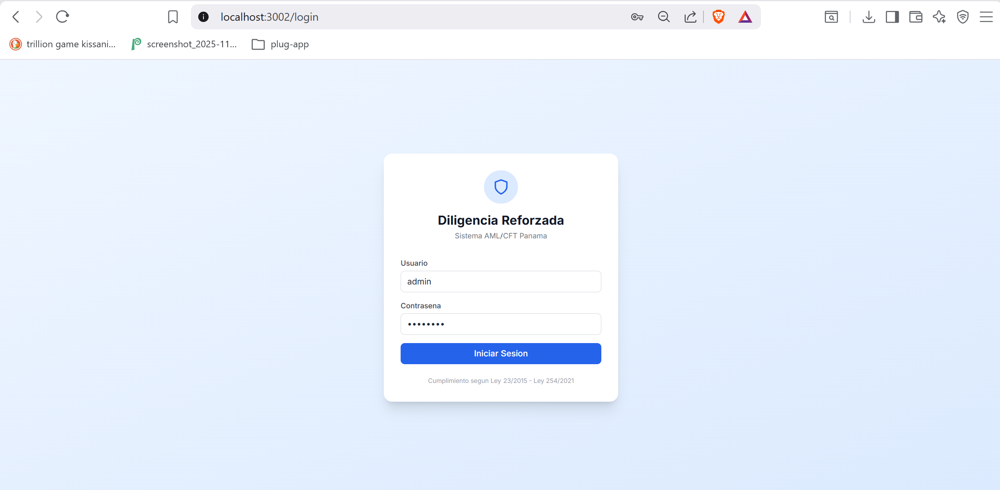

**Figura A.2.** Dashboard con los datos de demostración: 8 expedientes en total, distribución por estado en el gráfico de pastel y por nivel de riesgo en el de barras (3 alto, 2 medio, 3 bajo).

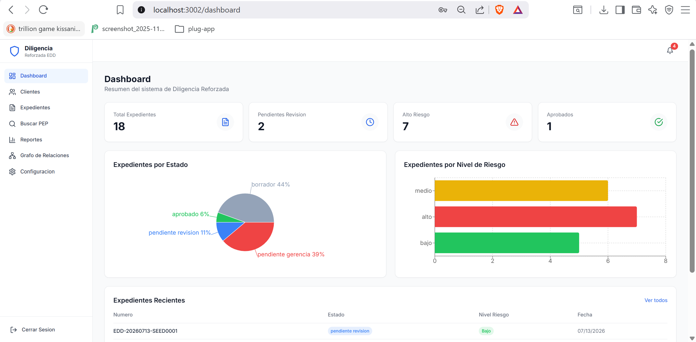

**Figura A.3.** Formulario EDD con los módulos en acordeón. Al marcar la casilla PEP se despliega la sección de información obligatoria (cargo, tipo de relación y país de residencia fiscal).

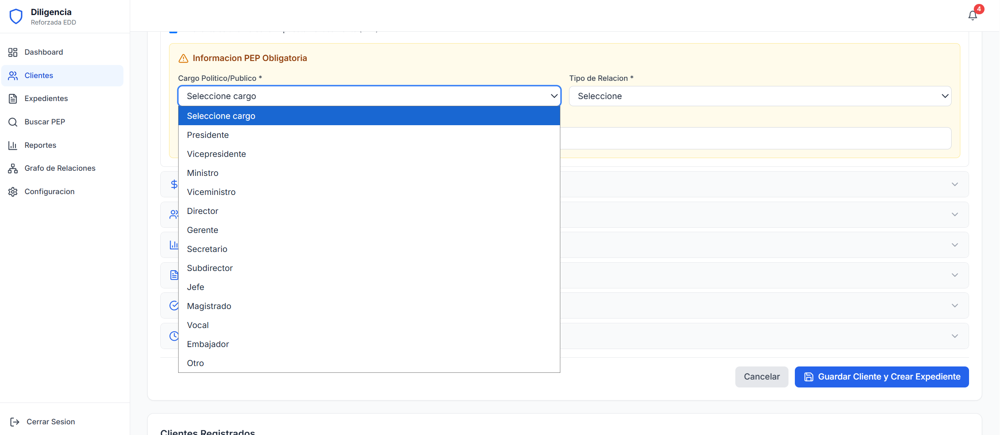

**Figura A.4.** Lista de expedientes con los distintivos de estado (Pendiente Gerencia, Aprobado, Borrador) y de nivel de riesgo.

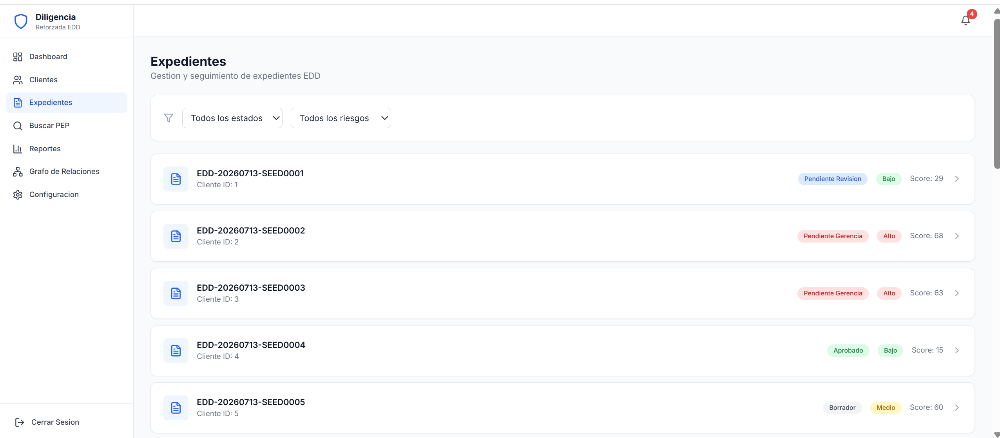

**Figura A.5.** Detalle de un expediente con sus pestañas (Detalle, Documentos, Trazabilidad) y el botón Exportar PDF.

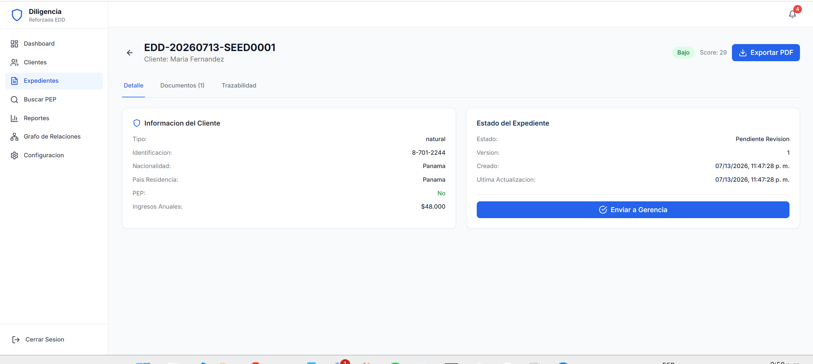

**Figura A.6.** Exportación del expediente a PDF: el sistema genera el archivo y el navegador lo descarga con el número de expediente como nombre.

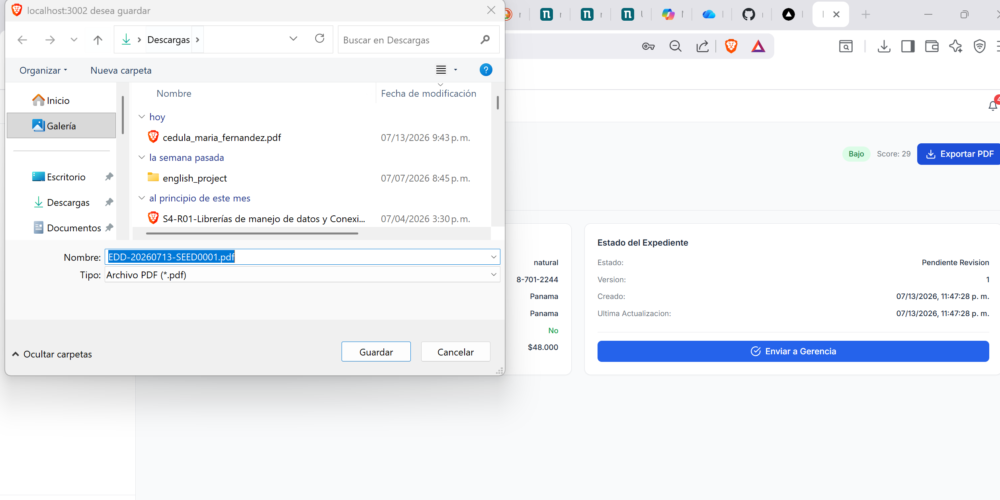

**Figura A.7.** Búsqueda PEP con coincidencia exacta por la cédula 8-702-3355: el sistema encuentra al funcionario con score de similitud 100.

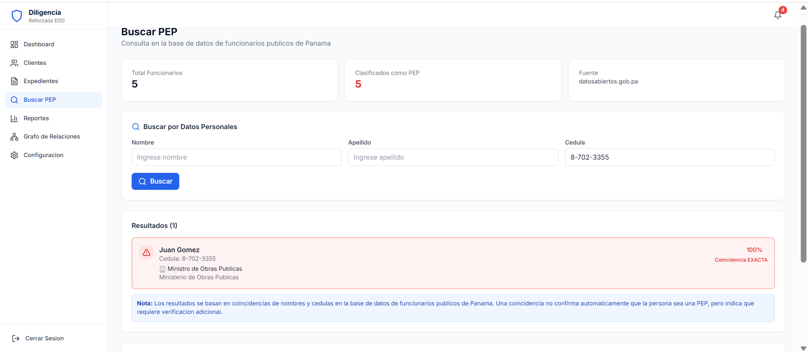

**Figura A.8.** Grafo de relaciones: el cliente PEP (nodo naranja) aparece como accionista de dos sociedades distintas. Arriba, la leyenda de colores.

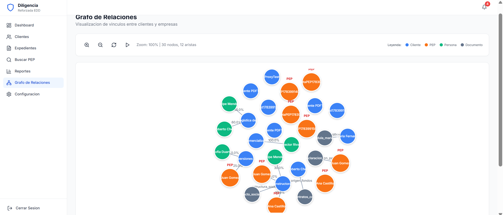

**Figura A.9.** Panel de alertas activas desplegado desde la campana de la barra superior.

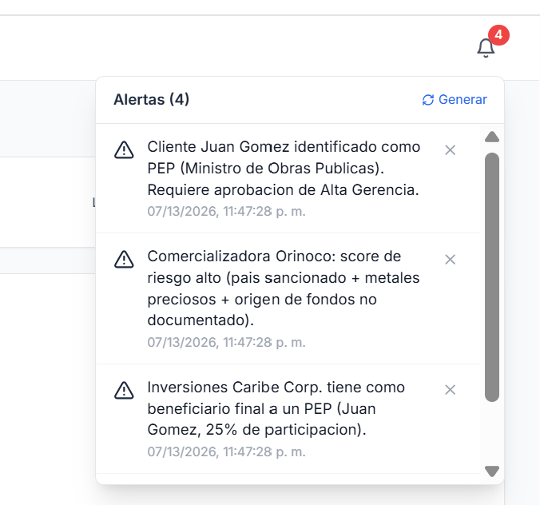

**Figura A.10.** Aprobación de un expediente: el sistema exige un comentario de justificación antes de registrar la decisión.

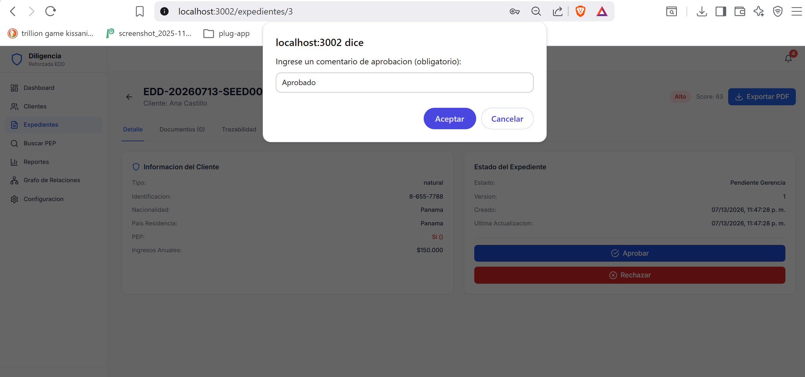

### Anexo B. Reportes de pruebas ejecutadas y resultados

Como parte del plan de pruebas definido en mayo (`plan-de-pruebas.md`), el equipo ejecutó un total de **116 pruebas automatizadas**, organizadas en dos suites complementarias: 91 pruebas de backend con pytest (unitarias y de integración por API) y 25 pruebas de extremo a extremo con Playwright, que abren un navegador real y recorren la aplicación como lo haría un usuario. Las pruebas de extremo a extremo siguen la clasificación del plan original en tres categorías: alfa (lógica interna y seguridad), beta (cumplimiento normativo) y UX (experiencia de usuario, responsividad y accesibilidad).

Se decidió mantener ambas suites porque cubren riesgos distintos: las pruebas de backend verifican que cada regla de negocio calcule lo correcto (por ejemplo, que un cliente de Irán con cargo de ministro obtenga el puntaje esperado), mientras que las de extremo a extremo verifican que el sistema completo funcione integrado, desde el clic del usuario hasta la base de datos. De hecho, los defectos más graves del cierre solo los detectó la segunda suite. A continuación se presenta el detalle de cada una con sus resultados.

#### B.1 Pruebas de backend (pytest)

Estas 91 pruebas se ejecutan en GitHub Actions en cada Pull Request y también pueden correrse dentro del contenedor Docker contra PostgreSQL. Resultado de la última corrida: **91 pruebas aprobadas, 0 fallidas** (una de ellas, la del límite de intentos de login, se omite automáticamente cuando el entorno tiene el límite elevado para las pruebas E2E, y corre normal en el CI).

| Archivo de pruebas | Cantidad | Qué verifica | Resultado |
|--------------------|----------|--------------|-----------|
| `test_riesgo_service.py` | 49 | Fórmula de riesgo: puntajes por país (10), cargo (8), sector (9), vínculos (6), origen de fondos (2), determinación del nivel (6) y cálculo completo (8) | 49 aprobadas |
| `test_security.py` | 14 | Hash de contraseñas con bcrypt (6) y creación y validación de JWT (8) | 14 aprobadas |
| `test_rbac.py` | 6 | Control de acceso por roles: rol permitido, admin siempre permitido, rol incorrecto rechazado con 403, variantes | 6 aprobadas |
| `test_worm.py` | 4 | Inmutabilidad de la auditoría: crear funciona, modificar y eliminar lanzan excepción, el registro queda intacto | 4 aprobadas |
| `test_refresh_token.py` | 5 | Refresh token con su tipo y expiración correctos, y rechazo del refresh usado como access | 5 aprobadas |
| `test_pdf_service.py` | 3 | El PDF se genera válido, tolera campos vacíos y caracteres fuera de latin-1 | 3 aprobadas |
| `test_api_security.py` | 7 | Integración por API: login con refresh, rotación, RBAC en aprobar y en auditoría, registro restringido, límite de intentos con respuesta 429 | 7 aprobadas |
| `test_api_pdf.py` | 3 | Integración por API: exportar PDF de un expediente real, 404 si no existe, 401 sin autenticación | 3 aprobadas |
| **Total** | **91** | | **91 aprobadas** |

#### B.2 Pruebas E2E (Playwright, navegador Chromium)

Estas 25 pruebas se ejecutan en GitHub Actions contra el sistema completo: el workflow levanta la base de datos, el backend y el frontend con Docker Compose, carga los datos de demostración y recién entonces corre la suite con un navegador Chromium. Resultado de la última corrida: **25 pruebas aprobadas, 0 fallidas**, con una duración total aproximada de 1 minuto. La tabla indica, para cada caso, a qué prueba del plan original corresponde:

| N.° | Caso | Prueba del plan | Resultado |
|-----|------|-----------------|-----------|
| 1 | TC-01 Login exitoso con admin | ALF-06 | Aprobada |
| 2 | TC-02 Login fallido muestra el error | ALF-06 | Aprobada |
| 3 | TC-03 Sin sesión redirige a /login | ALF-06 | Aprobada |
| 4 | Rutas protegidas redirigen a /login | ALF-07 | Aprobada |
| 5 | TC-04 No permite guardar con campos obligatorios vacíos | ALF-02 | Aprobada |
| 6 | TC-05 Crea un cliente con datos válidos | ALF-02 | Aprobada |
| 7 | TC-06 Los campos PEP son obligatorios si el cliente es PEP | ALF-02 / UX-02 | Aprobada |
| 8 | Módulo de beneficiario final se abre y muestra su contenido | ALF-01 | Aprobada |
| 9 | TC-07 Un cliente PEP genera expediente pendiente de gerencia con riesgo alto | BET-02 | Aprobada |
| 10 | TC-08 Aprobar exige comentario | ALF-04 | Aprobada |
| 11 | TC-09 Crear un cliente genera evento de auditoría visible en la trazabilidad | ALF-05 | Aprobada |
| 12 | TC-10 Editar un cliente genera evento de auditoría | ALF-08 | Aprobada |
| 13 | Los eventos de auditoría tienen fecha de creación | ALF-09 | Aprobada |
| 14 | TC-11 El expediente del PEP requiere aprobación gerencial | BET-02 | Aprobada |
| 15 | TC-12 Carga de documento en el expediente | BET-01 | Aprobada |
| 16 | TC-13 Los campos PEP aparecen al marcar la casilla | UX-02 | Aprobada |
| 17 | TC-14 Los campos PEP se ocultan al desmarcarla | UX-02 | Aprobada |
| 18 | Colores de riesgo consistentes entre páginas | UX-03 | Aprobada |
| 19 | TC-15 El grafo carga con nodos, aristas y leyenda | UX-04 | Aprobada |
| 20 | TC-16 Los controles de zoom funcionan (acercar, alejar, restablecer) | UX-04 | Aprobada |
| 21 | TC-17 Los nodos del grafo se pueden arrastrar | UX-04 | Aprobada |
| 22 | TC-18 En móvil (320 px) no hay desplazamiento horizontal | UX-06 | Aprobada |
| 23 | TC-19 En tableta (768 px) el diseño se adapta | UX-06 | Aprobada |
| 24 | TC-20 Los elementos interactivos tienen etiqueta accesible o texto visible | UX-07 | Aprobada |
| 25 | Contraste de colores en los textos principales | UX-07 | Aprobada |

Nota sobre BET-03 (listas OFAC/ONU/UE): no aplica, documentado como exclusión por falta de APIs públicas gratuitas.

**Figura B.3.** Resultado de la suite de backend: pytest con las 91 pruebas aprobadas.

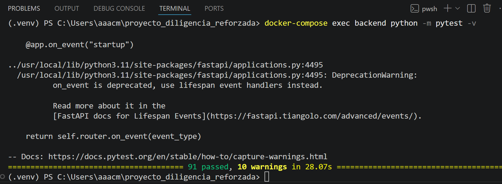

**Figura B.4.** Resultado de la suite de extremo a extremo: Playwright con las 25 pruebas aprobadas.

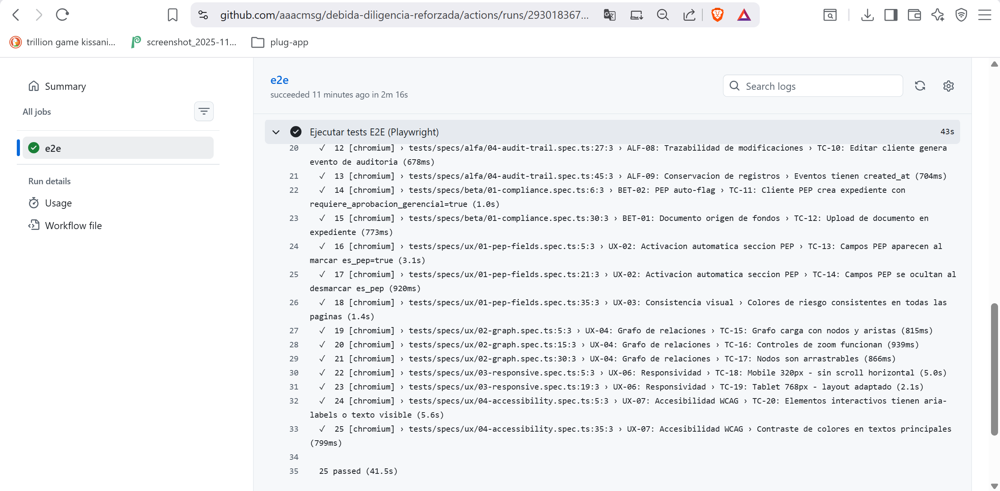

**Figura B.5.** Workflow de pruebas E2E ejecutándose en verde en GitHub Actions.

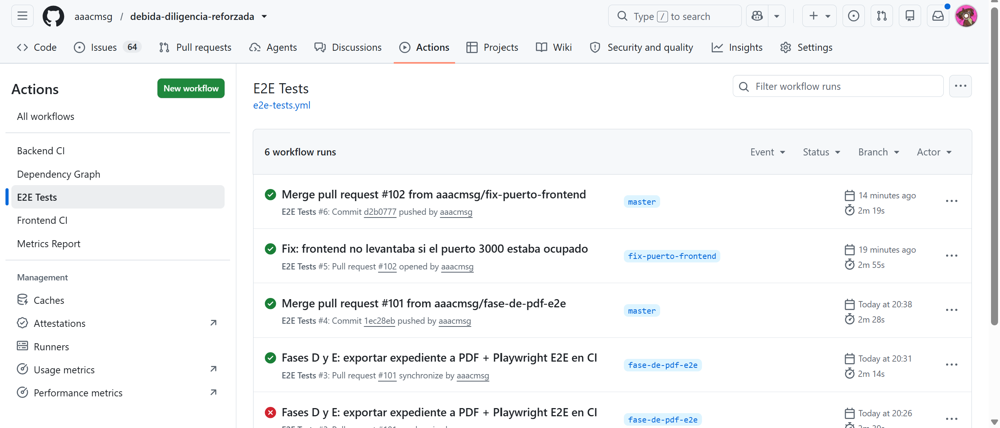

### Anexo C. Métricas aplicadas con valores reales e interpretación

Todas las cifras de este anexo provienen de una medición realizada el 14 de julio de 2026 sobre el código final del proyecto, ejecutando las herramientas indicadas en cada fila. Ningún valor es estimado. Las métricas se agrupan según las tres dimensiones trabajadas en la materia: las de pruebas (enfoque ISTQB), las de código y las de proceso (enfoque TMMi y TQM). Junto a cada valor se incluye su interpretación, porque un número sin lectura no orienta ninguna decisión: la interpretación es la que indica si el valor es aceptable y qué acción correspondería tomar.

#### C.1 Métricas de pruebas (ISTQB)

| Métrica | Valor real | Herramienta | Interpretación |
|---------|-----------|-------------|----------------|
| Pruebas de backend | 91 (63 unitarias del Parcial 2 + 28 nuevas) | pytest | El crecimiento corresponde a las funcionalidades de seguridad y PDF agregadas en el cierre |
| Pruebas E2E | 25 | Playwright | Cubren los 20 casos del plan de pruebas más 5 verificaciones adicionales |
| Tasa de éxito | 100% (91/91 y 25/25) | pytest, Playwright | No hay pruebas fallando ni deshabilitadas |
| Cobertura de línea del backend | 70% (1,367 sentencias, 409 sin cubrir) | pytest-cov | Subió del 26% al 70% gracias a las pruebas de integración por API. Lo no cubierto se concentra en los endpoints de alertas, configuración y documentos |
| Densidad de pruebas del backend | 34.4 pruebas por KLOC (91 / 2.648) | cálculo directo | Densidad alta para el tamaño del proyecto |
| Defectos detectados en el cierre | 7 (3 críticos, 3 altos, 1 medio) | pruebas E2E y revisión | Todos corregidos; la sección 3.4 detalla cada uno |
| Defectos abiertos al cierre | 0 | seguimiento en issues | No quedan fallas conocidas sin resolver |

#### C.2 Métricas de código

| Métrica | Valor real | Herramienta | Interpretación |
|---------|-----------|-------------|----------------|
| Líneas de código del producto | 6,430 (backend 2,648 + frontend 3,782) | conteo de líneas | Proyecto de tamaño mediano para un equipo de 3 personas |
| Líneas de código de pruebas y scripts | 1,939 | conteo de líneas | Cerca del 30% del tamaño del producto está dedicado a verificación |
| Complejidad ciclomática promedio | 2.48, calificación A (131 bloques analizados) | radon cc | El código es mayormente simple y fácil de mantener |
| Bloques con complejidad alta | 2: `generar_pdf_expediente` con 26 (D) y `buscar_funcionario` con 12 (C) | radon cc | El generador de PDF es una secuencia larga de secciones con condicionales simples; aun así, ambos quedan como candidatos a refactorización (sección 5.4) |
| Incidencias de estilo | 35 (17 imports sin uso, 5 archivos sin salto de línea final, 4 líneas largas, 4 comparaciones con False, 2 except genéricos, 2 de indentación, 1 variable sin uso) | flake8 | Son incidencias menores que no afectan el funcionamiento; se recomienda limpiarlas y hacer el linter obligatorio en CI |
| Vulnerabilidades de seguridad | 0 | bandit | El análisis estático no reporta patrones inseguros en el backend |

#### C.3 Métricas de proceso (TMMi, TQM)

| Métrica | Valor real | Fuente | Interpretación |
|---------|-----------|--------|----------------|
| Pull Requests del cierre | 3 (#99, #100, #101), los tres con CI en verde antes del merge | GitHub | Todo el incremento del cierre pasó por revisión y verificación automática |
| Workflows de CI activos | 4 (backend, frontend, E2E y métricas semanales) | GitHub Actions | Cada cambio se verifica automáticamente en tres frentes |
| Issues gestionados | Más de 100, con etiquetas por área y cierre con evidencia | GitHub Issues | La trazabilidad tarea-código-prueba se mantiene en la misma plataforma |
| Requisitos del plan de pruebas ejecutados | 19 de 20 (el restante, BET-03, es una exclusión documentada) | plan-de-pruebas.md | El plan definido en mayo se completó |

**Figura C.4.** Dashboard de métricas generado automáticamente por el script del proyecto (dos vistas: indicadores generales y detalle por herramienta).

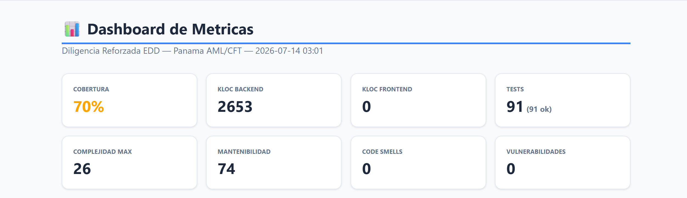

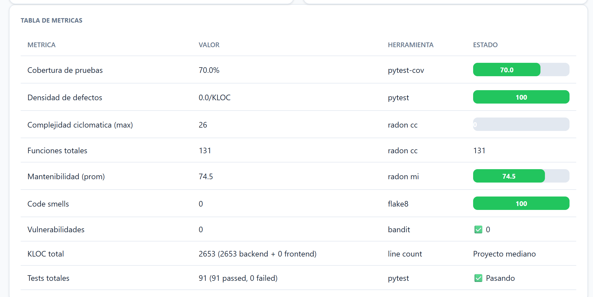

### Anexo D. Evidencias de gestión y versionamiento

Estas capturas evidencian que la gestión del proyecto se llevó en la misma plataforma que el código: el tablero de GitHub Projects para el estado de las tareas, los issues para el detalle de cada una, el historial de commits y Pull Requests para los cambios, y GitHub Actions para la verificación automática.

**Figura D.1.** Tablero de GitHub Projects con las columnas Backlog, In progress y Done.

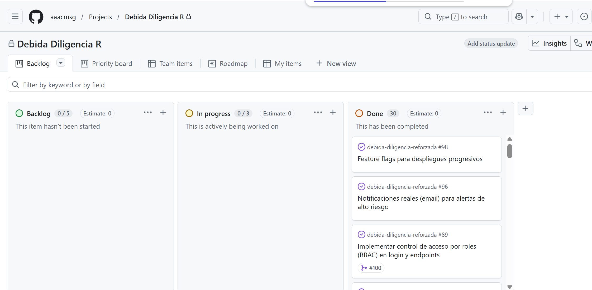

**Figura D.2.** Issues del repositorio con sus etiquetas por área, mostrando el trabajo cerrado con evidencia.

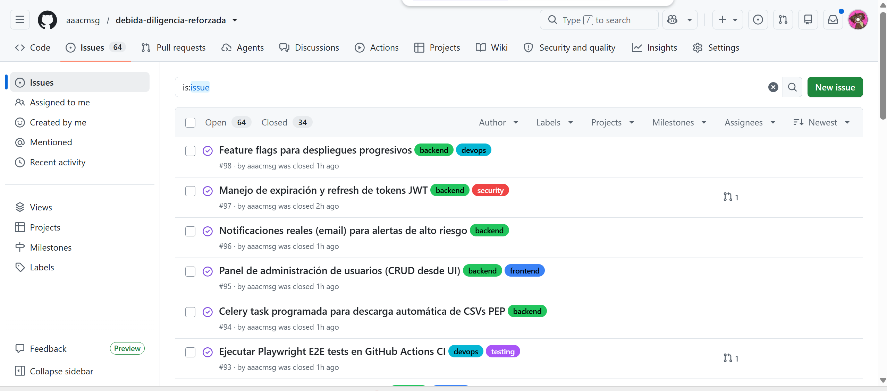

**Figura D.3.** Historial de commits de la rama master, incluyendo los merges de los Pull Requests del cierre.

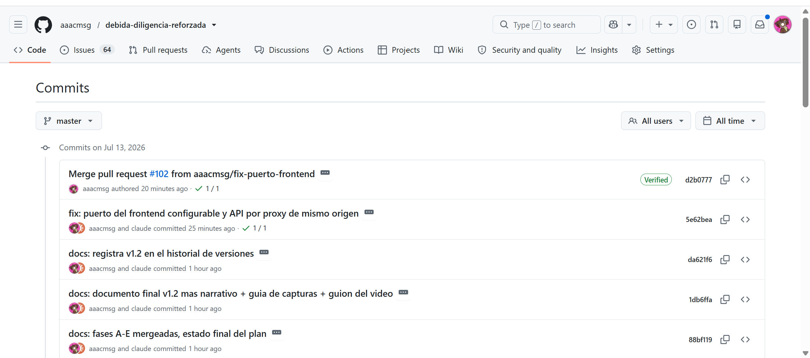

**Figura D.4.** Pull Requests del cierre con sus verificaciones de integración continua en verde.

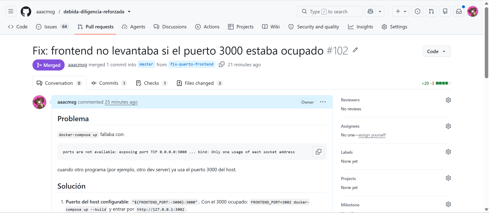

**Figura D.5.** Workflows de GitHub Actions del proyecto (backend, frontend, E2E y métricas).

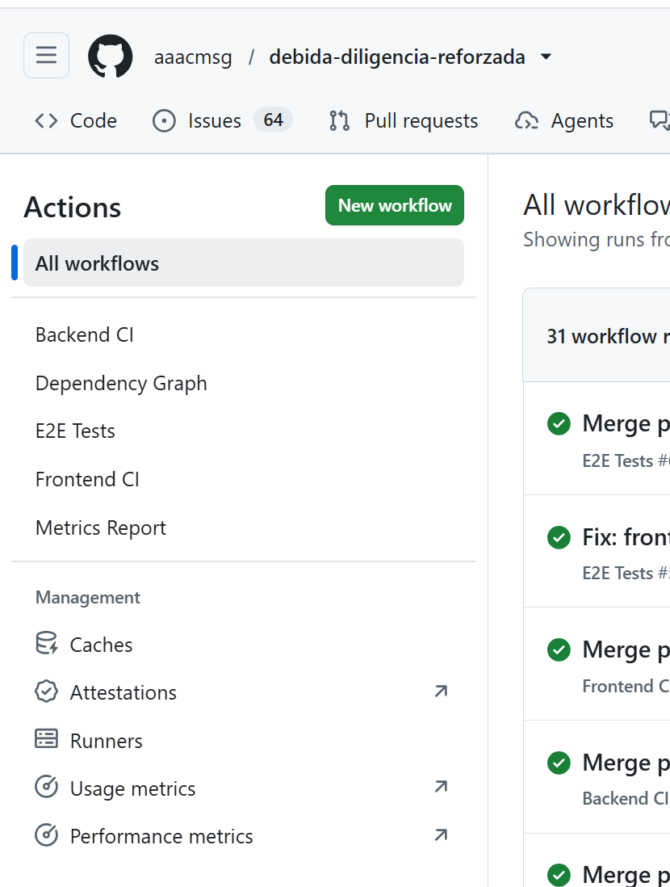

### Anexo E. Código relevante

Fragmentos citados en el documento, ubicados en el repositorio:

| Referencia | Archivo | Contenido |
|------------|---------|-----------|
| E.1 | `backend/app/services/riesgo_service.py` | Fórmula ponderada de riesgo y clasificación por nivel |
| E.2 | `backend/app/api/v1/endpoints/clientes.py` | Regla PEP y creación automática del expediente |
| E.3 | `backend/app/core/security.py` | Control de acceso por roles y emisión de tokens |
| E.4 | `backend/app/models/models.py` | Eventos de inmutabilidad de la auditoría (final del archivo) |
| E.5 | `backend/app/services/pdf_service.py` | Generación del PDF del expediente |
| E.6 | `frontend/src/services/api.ts` | Interceptor de renovación automática del token |
| E.7 | `backend/scripts/seed_demo.py` | Datos de demostración reproducibles |

---

*Documento final del Proyecto Semestral. Ingeniería de Software IV, Universidad Tecnológica de Panamá.*
